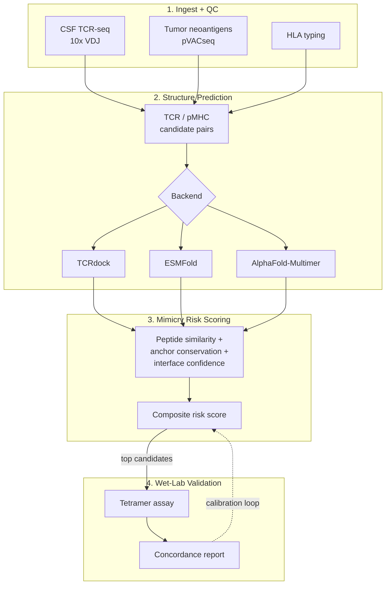

# CSF TCR–pMHC Molecular Mimicry Discovery

**Cross-Reactive Autoimmunity Discovery: Structure-Based TCR–pMHC Modeling to Identify Occult Tumor-Neuronal Molecular Mimicry Driving Seronegative Paraneoplastic Neurodegeneration**

[](https://github.com/YOUR-ORG/csf-tcr-mimicry-discovery/actions/workflows/ci.yml)
[](LICENSE)

[](https://github.com/astral-sh/ruff)
[](CITATION.cff)

---

> **Research use only.** Outputs are a *candidate-prioritization score* for wet-lab
> follow-up, not a validated clinical diagnostic. See [`docs/model_card.md`](docs/model_card.md).

## Status

| Stage | State |
|---|---|
| `io` — TCR-seq / neoantigen / HLA parsing | ✅ Implemented + tested |
| `scoring` — mimicry risk score | ✅ Implemented + tested (rule-based; learned-model swap-in point ready) |
| `structure` — TCRdock / ESMFold / AlphaFold-Multimer adapters | 🚧 Scaffolded — interface + tests done, model calls marked `TODO` |
| `workflow/` — Snakemake orchestration | 🚧 Not yet added (tracked separately) |
| `wetlab/` — tetramer validation loop | 🚧 Planned |

The smoke test below runs everything in the first two rows end-to-end against bundled synthetic fixtures — no GPU, no real patient data required.

## Architecture



Full directory layout and the rationale behind it: see the architecture doc from
design phase 1 (`docs/adr/`) — condensed version [below](#repository-layout).

## Quickstart

Local (no Docker), clone to smoke test in under 10 minutes:

```bash
git clone https://github.com/YOUR-ORG/csf-tcr-mimicry-discovery.git
cd csf-tcr-mimicry-discovery

python3 -m venv .venv && source .venv/bin/activate
pip install -e ".[dev]"

mimicry-discovery --help          # confirms the CLI installed correctly
pytest tests/unit -v              # ~60 unit tests, seconds
pytest tests/integration -v       # end-to-end smoke test on synthetic fixtures
```

Or with Docker, no local Python setup at all:

```bash
docker compose run --rm dev
# inside the container:
pytest tests/unit tests/integration -v
```

Both paths exercise the same code CI runs on every PR (`.github/workflows/ci.yml`).

## Repository layout

```
mimicry_discovery/   # installable package: io, structure, scoring, self_antigen, lineage, cli
config/               # config.yaml + JSON-Schema validation, Snakemake profiles (slurm/cloud)
data/test/            # small synthetic fixtures used by CI -- never real patient data
tests/unit/           # one test file per source module
tests/integration/    # end-to-end smoke test against data/test/ fixtures
containers/           # Dockerfile targets + Docker->Singularity conversion for HPC
.github/workflows/    # CI: lint, type-check, unit tests, smoke test (all separate jobs)
```

`data/raw/`, `models/`, and `data/reference/` are intentionally not populated in git —
they're DVC-tracked or institution-secured. See [`DATA_GOVERNANCE.md`](DATA_GOVERNANCE.md).

## Roadmap

What's implemented vs. scaffolded is tracked in the [Status](#status) table above;
what's planned next, broken into sprints and traceable to specific `TODO`s in the
code, is in [`docs/roadmap.md`](docs/roadmap.md) — `scripts/seed_github_project.sh`
turns it into real GitHub issues and a Project board.

## Running at scale

- **HPC/SLURM:** `config/profiles/slurm/` + `scripts/submit_slurm.sh` (Snakemake profile; DAG orchestration itself is tracked separately from this phase).
- **Cloud:** `config/profiles/cloud/`, same rule code, different executor — see the architecture rationale for why environment-specific config never leaks into rule/package code.
- **Containers:** `docker compose up scoring` (CPU) or `docker compose up structure-prediction` (GPU, needs the [NVIDIA Container Toolkit](https://github.com/NVIDIA/nvidia-container-toolkit)). For HPC nodes without rootful Docker: `containers/singularity/build_sif.sh`.

## Contributing

Wet-lab and dry-lab workflows differ enough that they get their own section — see
[`CONTRIBUTING.md`](CONTRIBUTING.md). Please also read [`CODE_OF_CONDUCT.md`](CODE_OF_CONDUCT.md)
and, if your change touches anything patient-derived, [`DATA_GOVERNANCE.md`](DATA_GOVERNANCE.md)
before opening a PR.

## Citation

GitHub will surface a "Cite this repository" button from [`CITATION.cff`](CITATION.cff).
For a manual BibTeX entry:

```bibtex
@software{mimicry_discovery_2026,
  title   = {Cross-Reactive Autoimmunity Discovery: Structure-Based TCR-pMHC
             Modeling to Identify Occult Tumor-Neuronal Molecular Mimicry
             Driving Seronegative Paraneoplastic Neurodegeneration},
  author  = {{Your Lab Name}},
  year    = {2026},
  url     = {https://github.com/YOUR-ORG/csf-tcr-mimicry-discovery},
  version = {0.1.0}
}
```

A Zenodo DOI will be minted per tagged release once container/registry setup
(tracked separately) is complete — the badge above will link there.

## License

[Apache 2.0](LICENSE) — confirm compatibility with your institution's tech-transfer
office given downstream clinical-adjacent use, per the note in the architecture doc.
